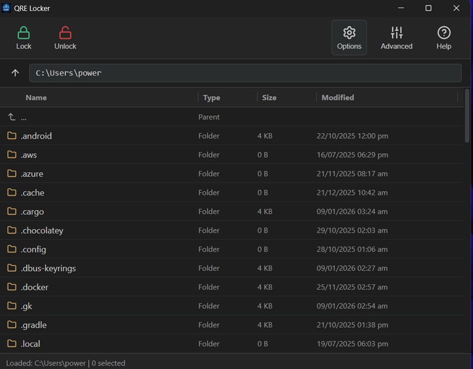

# QRE Locker (v2.3.0)

**A Modern, Quantum-Resistant File Encryption Tool.**

QRE Locker is a cross-platform desktop application designed to secure your data against both modern cyber threats and future quantum computing attacks. It combines the speed of **AES-256-GCM** with the post-quantum security of **ML-KEM-1024 (Kyber)** in a user-friendly, local-first interface.



## 🚀 What's New in v2.3.0?

We have introduced major security and usability upgrades in this release:

- **🚨 Panic Button:** Global hotkey (`Ctrl+Shift+Q`) to instantly wipe keys from RAM and kill the application process.
- **🗑️ Secure Shredding:** Option to securely overwrite files with random data (3-pass) before deletion, making recovery impossible.
- **🎨 Themes:** Support for **Dark**, **Light**, and **System** modes.
- **💾 Keychain Backup:** Built-in tool to export your encrypted keychain for disaster recovery.
- **🖱️ Enhanced UX:** Resizable file columns, right-click context menus, and drag-and-drop file locking.
- **⏱️ Auto-Lock:** Session timeout after 15 minutes of inactivity.
- **🗜️ Smart Compression:** Customizable Zip compression levels (Fast, Normal, Best).

## 🛡️ Security Architecture

QRE Locker employs a **Hybrid Cryptographic Scheme** ensuring defense-in-depth:

1. **Session Security:** Every time you lock a file, a unique, ephemeral **AES-256-GCM** key and **ML-KEM-1024** keypair are generated.
2. **Hybrid Layering:** The file content is compressed (Zstd) and encrypted with AES-256. The AES key is then encapsulated by the Kyber public key.
3. **Key Wrapping:** The Kyber Private Key (needed to unlock the file) is encrypted using your **Master Key**.
4. **Master Key Derivation:** Your Master Key is derived from your Passphrase (and optional Keyfile) using **Argon2id** (Memory-Hard Function).
5. **Memory Safety:** Critical keys are marked with `Zeroize`, ensuring they are wiped from RAM immediately after use.

### The Tech Stack

- **Frontend:** React (TypeScript) + Vite
- **Backend:** Rust (Tauri v2)
- **Crypto Libraries:** `pqcrypto-kyber`, `aes-gcm`, `argon2`, `sha2`
- **Compression:** `zstd` + `zip` (v2.x)

## 📦 Installation

Download the latest installer for your operating system from the [Releases Page](https://github.com/powergr/quantum-locker/releases).

- **Windows:** `.exe` or `.msi`
- **macOS:** `.dmg`
- **Linux:** `.deb` or `.AppImage`

> **Note:** As this is open-source software, the installer is currently self-signed. You may need to click "More Info" -> "Run Anyway" if Windows SmartScreen prompts you.

## 📖 User Guide

### 1. Setup & Backup

On first launch, create a **Master Password**.

**Recovery Code:** Save the displayed code (e.g., `QRE-A1...`). It is your only way back if you forget the password.
**Backup:** Go to **Options > Backup Keychain** and save the JSON file to a USB drive. This file + your password can restore your account on any computer.

### 2. Locking & Unlocking

**Lock:** Drag files into the window or use **Right Click > Lock**. Original files are processed; encrypted `.qre` files are created.
**Unlock:** Select `.qre` files and click **Unlock**.
**Double-Click:** You can double-click a `.qre` file in your OS File Manager to open it directly in QRE Locker.

### 3. Advanced Security

**Keyfile:** (Optional) Go to **Advanced** to select a file (image/song) as a second factor. You must have this exact file present to unlock your data.
**Paranoid Mode:** Injects hardware-based entropy (mouse movements) into the key generation.
**Panic Button:** Press **`Ctrl + Shift + Q`** at any time to instantly terminate the app and wipe memory.

## 🛠️ Development Setup

### Prerequisites

- [Node.js](https://nodejs.org/) (v18+)
- [Rust](https://www.rust-lang.org/) (latest stable)
- **Windows:** C++ Build Tools (via Visual Studio Installer)
- **Linux:** `libwebkit2gtk-4.1-dev`, `build-essential`

### Build

```bash
# Install dependencies
npm install

# Run in Dev Mode
npm run tauri dev

# Build Release
npm run tauri build
```

---

**License:** MIT License. See [LICENSE](LICENSE) file.
